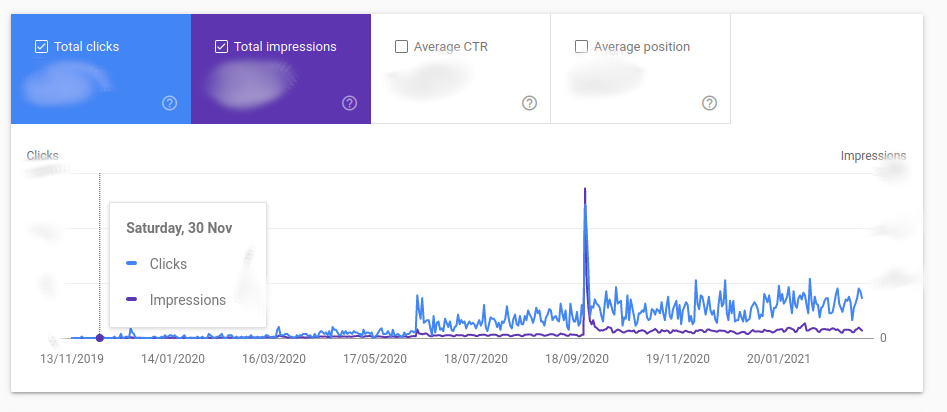
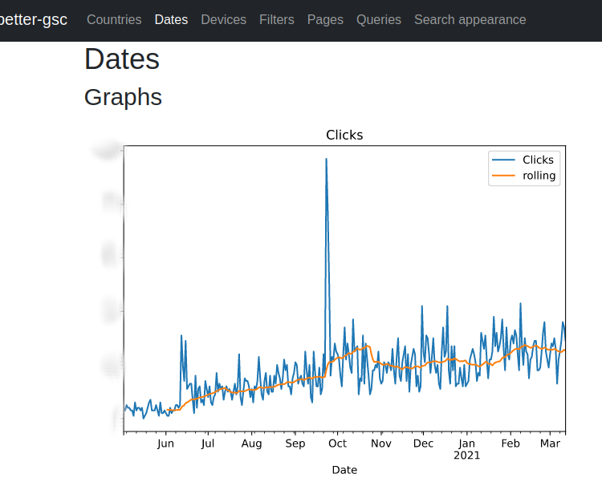
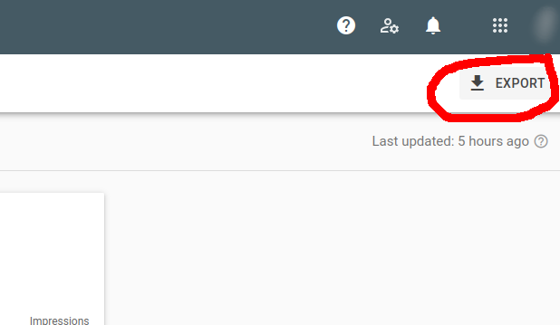

# better-gsc

A (personal) tool for taking exports from the Google Search Console and creating better graphs.

From this:



To this:



## Key features

- Rolling averages
- That's your lot

## Getting started

Either inside a virtualenv, or just globally (wahoo):

```
pip install .
```

When pass the export zip file to it:

```
better-gsc http_something.zip
```

And visit localhost:5000

## Exporting from Google Search Console

Click this button:



Take the "CSV" option, which is in fact a zipfile of multiple CSVs.
